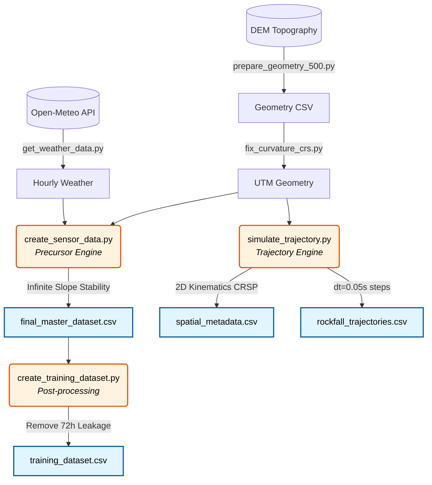

# 🪨 Noamundi Rockfall Simulation Pipeline


## 📌 1. Project Overview
This repository contains the full **data generation pipeline and dual physics engines** used to create the Noamundi Rockfall Simulation Dataset. It simulates rockfall precursor conditions (via Infinite Slope Stability modeling) and downstream trajectory runouts (via 2D CRSP kinematics) for 500 monitoring locations in the Noamundi mining region in Jharkhand, India.

> [!WARNING]
> This codebase generates a *simulated dataset* mapping real-world terrain and weather variables to simulated physics sensors and trajectories. It is not tracking real historical rockfalls.

---

## 🛠️ 2. Setup & Installation

Clone the repository and install the dependencies to run the simulation pipeline yourself:

```bash
git clone https://github.com/kaizen105/Rockfall_dataset.git
cd Rockfall_dataset
pip install pandas numpy rasterio pyproj scipy matplotlib requests
```

*(Note: The codebase expects terrain data to exist in `data_v2/` prior to execution, which is not tracked in git due to size).*

---

## ⚙️ 3. Pipeline Architecture & Execution

The dataset is generated via a linear execution of the scripts located in `src/data/`. If you are regenerating the dataset from scratch, run them in this exact order.

### 3.1 Project Structure

```text
Rockfall_dataset/
├── data_v2/                        # (Ignored by git) Final generated data and trajectories
├── notebooks/                      # Exploratory data analysis & model prototyping
├── qgis_raw_data/                  # Original raw DEM & raster files
├── results/                        # Generated analysis results and summaries
├── src/                            
│   ├── analysis.py                 # Ad-hoc analysis scripts
│   └── data/                       # Core data generation pipeline scripts
│       ├── prepare_geometry_500.py
│       ├── fix_curvature_crs.py
│       ├── get_weather_data.py
│       ├── create_sensor_data.py
│       ├── simulate_trajectory.py
│       └── create_training_dataset.py
└── README.md
```

### 3.2 Pipeline Data Flow



### 3.3 Pre-processing
1. **`prepare_geometry_500.py`**: Extracts the foundational coordinates and elevations from the DEM for the 500 monitoring locations.
2. **`fix_curvature_crs.py`**: A specialized utility to reproject geographical CRS (WGS84) to local projected CRS (UTM) so that topographic metrics (planform/profile curvature, slope, TRI) can be correctly computed in meters rather than degrees.
3. **`get_weather_data.py`**: Calls the Open-Meteo historical API to pull hourly weather timeseries (precipitation, temperature, radiation) mapped directly to the Noamundi coordinates.

### 3.4 Main Simulation Engines
4. **`create_sensor_data.py`** *(The Precursor Engine)*: 
   Fuses the weather and terrain data, computes the 1D Factor of Safety (FS) using Infinite Slope Stability equations, and generates the massive hourly timeseries (12M+ rows) mapping displacement and vibration precursors. Outputs `final_master_dataset.csv`.
5. **`simulate_trajectory.py`** *(The Kinematics Engine)*: 
   Drops simulated boulder masses (500kg, 2000kg, 10000kg) from each location and traces their downhill paths using rigid-body impact restitution (CRSP parameters). Outputs the static maximums to `spatial_metadata.csv` and the dense spatial steps to `rockfall_trajectories.csv`.

### 3.5 Post-processing for ML
6. **`create_training_dataset.py`**: 
   Cleans `final_master_dataset.csv` by strictly dropping the 72-hour windows *following* any rockfall event. This removes post-event sensor anomalies, strictly preventing target leakage and making the resulting `training_dataset.csv` perfectly safe for ML model training.

---

## 📊 4. The Output Dataset

Running the pipeline yields the following files:
- **`training_dataset.csv`**: The hourly predictive timeseries containing weather, terrain metadata, and simulated IoT sensor readings (leakage removed).
- **`spatial_metadata.csv`**: Static geographical, geomorphological, and geomechanical metadata for all 500 locations, including the final trajectory maximums (runout, bounce height, energy). Also contains the `Profile_Clipped` boundary flag.
- **`data_v2/trajectories/rockfall_trajectories.csv`**: Full spatio-temporal pathing ($dt=0.05s$) mapping `Time_s`, `Distance_s_m`, `Elevation_z_m`, velocities, energies, and kinematic `State` (BOUNCING/SLIDING).

---

## 🧮 5. Physics Engines Methodology

### 5.1 Precursor Engine (Infinite Slope Stability)
The 1D slope stability model computes Factor of Safety (FS):
`FS = [ c + (γ · z · cos²β - u) · tanφ ] / [ γ · z · sinβ · cosβ ]`

- Geotechnical parameters (`γ`: 20-25 kN/m³, `φ`: 30°-40°, `c`: 4-10 kPa) are typical ranges for open-pit mining contexts per Hoek & Bray.
- Pore pressure `u = γ_w * min(1.0, rain_72h / 100.0) * z`. The `100.0` mm threshold for full saturation is a heuristic engineering assumption.
- 80% of events occur when `FS ≤ 1.3`, with the probability of failure exponentially weighted (`P ∝ exp(5 * (1.3 - FS))`). The remaining 20% are random stochastic triggers representing 'dry rockfalls'.

### 5.2 Trajectory Engine (2D Kinematics)
To simulate downstream hazard, the 2D kinematics engine uses discrete Euler integration ($dt=0.05s$) mapping rigid-body impact restitution and rolling friction.
- Uses Colorado Rockfall Simulation Program (CRSP) industry-standard parameters for vegetated talus slopes ($R_n = 0.35$, $R_t = 0.85$, $\mu = 0.15$).
- Sliding / Rolling Friction is triggered when normal velocity drops below a bounce threshold ($v_{out,n} < 0.5$ m/s).
- **Data Target Isolation:** Runout distances and kinetic energies are appended strictly as static topological metadata to prevent target leakage into the hourly predictive timeseries.

---

## 📈 6. Validation Analysis

- **Event-Window Correlation:** Average pre-event windows show a genuine sustained climb in displacement (~0.025 to ~0.13 mm/h over 72 hours), compared to a flat ~0.015 mm/h for random non-event windows. 
- **Truncation Check:** 5 out of 499 valid locations (1.0%) reached the boundary of their extracted DEM raster array and were cut off mid-flight (explicitly flagged via `Profile_Clipped = True`). The vast majority of boulders naturally halted due to simulated physical friction rather than hitting array boundary edges.
- **Energy Mass Scaling:** Verified perfectly linear scaling across masses. At identical locations, the 2000kg boulder yields exactly 4.00x the kinetic energy of the 500kg boulder, and the 10000kg boulder yields exactly 20.00x, mathematically confirming runout distance is correctly mass-independent in the kinematics engine.
- **Invalid Profile Flagging:** The `Profile_Valid` flag successfully caught 1/500 locations (`LOC_65`) that touched a DEM NoData boundary at initialization, zeroing out its resulting metrics.

---

## ⚠️ 7. Known Limitations
- Simulated ground truth, not field-validated.
- **DEM Resolution limitation:** The NASA SRTM GL1 30m resolution is coarse relative to individual boulder-scale features.
- Simplified 1D slope stability physics (no 3D/groundwater/fracture modeling).
- **Constant Azimuth 2D Trajectories:** The kinematic engine extracts a straight-line downslope profile based on the initial steepest descent azimuth. It does not dynamically trace 3D topographic curvature during runout.
- **Point-Mass Trajectories:** Kinematics ignore boulder shape, fragmentation, angular momentum, and air drag.
- **Poisson Event Floor Bias:** Event count is governed by an artificial `max(1, poisson(5))` floor, ensuring no location is perfectly stable (0 events).

---

## 🎯 8. Suggested ML Tasks
- **Classification & Anomaly Detection:** Benchmarking rare-event logic under physically grounded class imbalance.
- **Precursor / Early-Warning Research:** Studying lead-time detection (mind the 80/20 rainfall vs random trigger split).
- **Cross-Location Generalization:** Testing models across different geographic baselines.
- **Spatio-Temporal Graph Neural Networks (ST-GNN):** Utilizing `rockfall_trajectories.csv` to graph spatial trajectory overlap, simulating downstream impact propagation and modeling hazard networks.

---

## 💻 9. Dataset & Resources
The completed ML-ready dataset generated by this pipeline is hosted directly on Hugging Face: [Kaizen696/noamundi-rockfall-simulation-dataset](https://huggingface.co/datasets/Kaizen696/noamundi-rockfall-simulation-dataset)

**External Data References Used by Pipeline:**
- **Terrain Data:** NASA SRTM GL1 30m via OpenTopography
- **Weather Data:** Historical hourly weather via Open-Meteo
